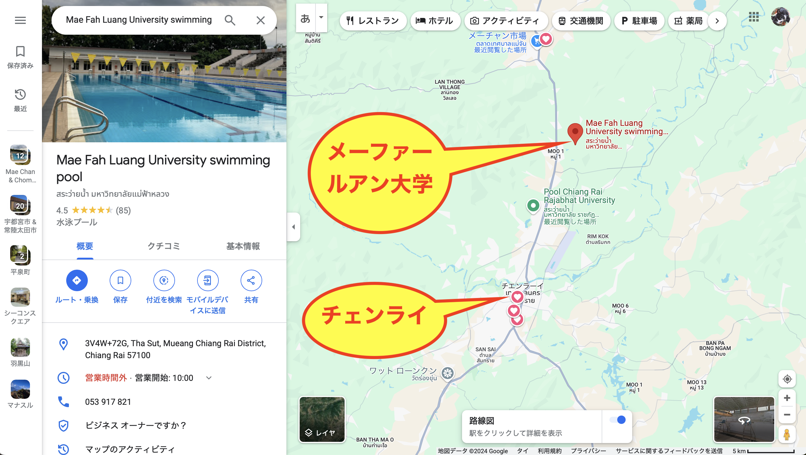
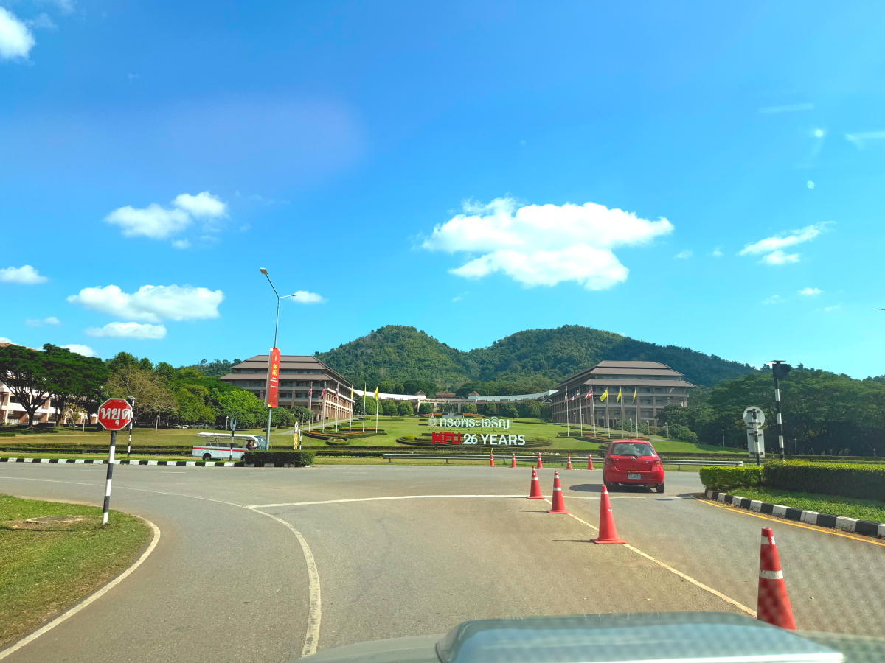
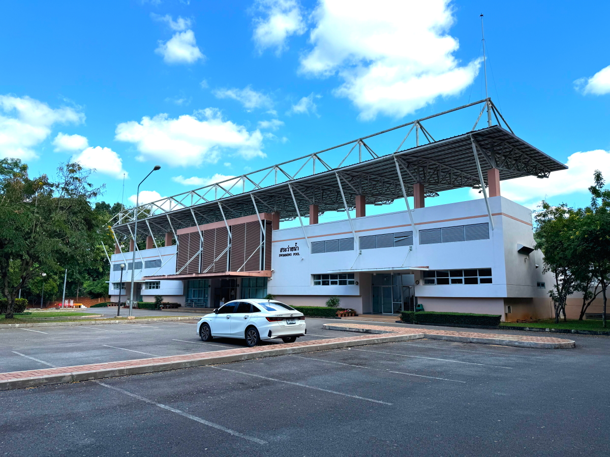
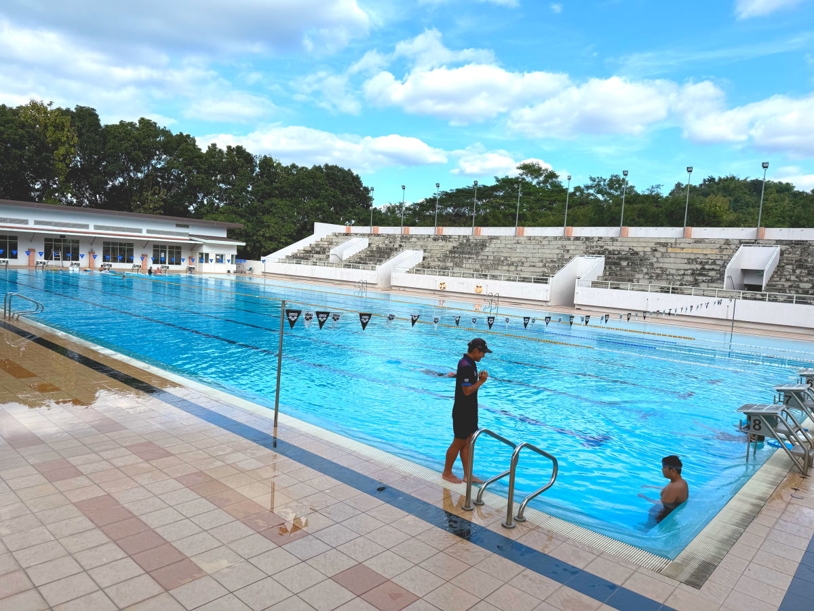

# 20241130_chiangrai

<html>
<head>

<meta charset="UTF-8">
<meta http-equiv="Content-Type" content="text/html; charset=UTF-8">
<meta http-equiv="X-UA-Compatible" content="IE=EmulateIE10" />
<meta http-equiv="X-UA-Compatible" content="IE=edge">

<!--ここから上はお決まりの定型文です-->

<!--ここからが表現の書式などを決めるcssという部分-->

<link href="https://cdnjs.cloudflare.com/ajax/libs/lightbox2/2.7.1/css/lightbox.css" rel="stylesheet">

</head>

<body>

モバイル端末をお使いの場合は、画面を横向きにすると
より見やすくご覧頂けます。

<!--ここ上は、ほぼそのまま使います！-->

<!--QRコードの挿入例-->

 アクセス用QRコード

<marquee direction="left" scrollamount="20" width="30%">(^_^)/~S,Hada</marquee>

<!--流れ文字の挿入例-->
<h1><marquee behavior="left">!!! 2024/11/30 、Mae Fah Luang University swimming pool !!!</marquee></h1>

                          

<!--ここから下が、本体部分-->

<h2>Mae Fah Luang University、画像クリックでGoogleMapsに飛びます</h2>

<h2>プールに行くには、国道からさらに３kmほど入ります</h2>

<h2>国道から1.７Km進むと大学の本体</h2>

<h2>さらに1.4Km先にある、プールの外観</h2>

<h2>プールは一般開放されていて、80バーツ（ ≒ ¥350-）で時間制限なしで入れます</h2>

  

<h2>子供達の水泳教室も開催されていました → 
<a href="https://youtube.com/shorts/kVv7HzktC0A?feature=share" target="_blank">プール景観の動画</a>
</h2>

   

<h2>国道の検問所から南下して大学敷地内に入りプールまで行く動画と、その逆コースの動画です</h2>

<iframe width="560" height="315" src="https://www.youtube.com/embed/JysIrIsgJjA?si=8oGc1zgshRkgIrG1" title="YouTube video player" frameborder="0" allow="accelerometer; autoplay; clipboard-write; encrypted-media; gyroscope; picture-in-picture; web-share" referrerpolicy="strict-origin-when-cross-origin" allowfullscreen></iframe> 

<iframe width="560" height="315" src="https://www.youtube.com/embed/j8ls7jPzLNk?si=d_-6NHQ-3uobTJK9" title="YouTube video player" frameborder="0" allow="accelerometer; autoplay; clipboard-write; encrypted-media; gyroscope; picture-in-picture; web-share" referrerpolicy="strict-origin-when-cross-origin" allowfullscreen></iframe>

   

         

  

      

<!--本体はここまで-->

<!--画面に空白地帯を作って、背景が見えるようにしています-->
                                              

<!-- フッタ -->
<footer>

Copyright 2024/11/30 S,Hada @ChiangRai

</footer>

<!--HPにさまざまなJavaScriptを呼び込むための書式-->

